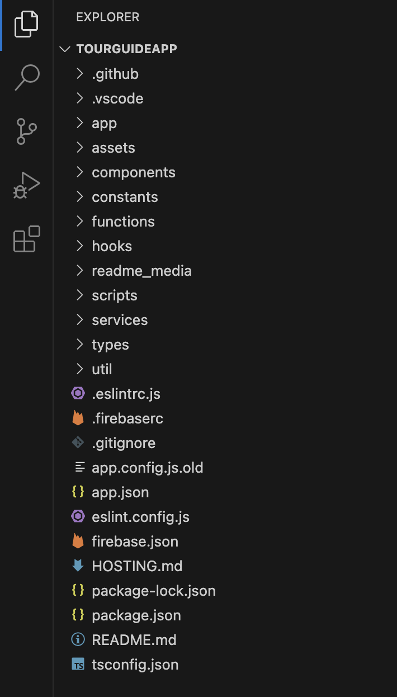

    

# St. George's Cathedral Tour Guide App

A React Native/Expo mobile Web app providing an interactive virtual tour experience for St. George's Cathedral in Cape Town, featuring an SVG based indoor map, Firebase backend, and POI system.

[](https://reactnative.dev/)
[](https://expo.dev/)
[](https://www.typescriptlang.org/)
[](https://firebase.google.com/)

## Table of Contents

- [About The Project](#about-the-project)
- [Tech Stack](#tech-stack)
- [Getting Started](#getting-started)
- [Project Structure](#project-structure)
- [Usage](#usage)
- [Deployment](#deployment)
- [Team](#team)


## About The Project

The St. George's Cathedral Tour Guide Web App is an interactive digital tour guide that allows visitors to explore the historic cathedral through a detailed SVG based floorplan. The app features 26 Points of Interest with historical information, high quality images, audio guides and responsive design that works seamlessly across mobile and desktop devices.

### Key Features

- **Interactive Floorplan**: SVG-based cathedral floorplan with 26 POI markers
- **Responsive Design**: Works seamlessly on mobile, tablet, and desktop
- **Image Gallery**: High quality images with full screen viewing
- **Audio Guide**: Text to speech audio descriptions
- **Privacy Compliant**: Cookie consent and analytics tracking
- **Mobile Optimized**: Portrait orientation lock and touch gestures
- **Modern UI**:  Consistent color scheme and smooth animations

## Tech Stack

### Frontend
- **React Native** - Cross platform mobile development
- **Expo** - Development platform and tools
- **TypeScript** - Type-safe JavaScript
- **React Navigation** - Navigation library
- **React Native SVG** - SVG rendering

### Backend & Services
- **Firebase Firestore** - NoSQL database
- **Firebase Storage** - Image storage
- **Firebase Cloud Functions** - Serverless functions
- **Firebase Analytics** - User analytics

### Development Tools
- **ESLint** - Code linting

## Getting Started

### Prerequisites

Before you begin, ensure you have the following installed:

- **Node.js** (v16 or higher) - [Download Node.js](https://nodejs.org/)
- **npm** (comes with Node.js) or **yarn** package manager
- **Git** - [Download Git](https://git-scm.com/)
- **Modern web browser** (Chrome, Firefox, Safari, or Edge)
- **Internet connection** for downloading dependencies and Firebase services
- **Firebase CLI** (for deployment) - Install with `npm install -g firebase-tools`

### Installation

#### Step 1: Clone the Repository

Clone the repository to your local machine:

```bash
git clone https://github.com/2BitDevelopment/TourGuideApp.git
cd TourGuideApp
```

#### Step 2: Install Dependencies

Install all required dependencies:

```bash
npm install
```

This will install:
- React Native and Expo dependencies
- TypeScript and type definitions
- Firebase SDK
- React Navigation
- All other project dependencies

**Expected Output:**
```
Installed all dependencies
```

#### Step 3: Firebase Configuration

Set up your Firebase configuration file:

1. Create a Firebase project at [Firebase Console](https://console.firebase.google.com/)
2. Enable Firestore Database and Firebase Storage
3. Add your Firebase configuration to `services/firebase.config.ts`:

```typescript
const firebaseConfig = {
  apiKey: "your-api-key",
  authDomain: "your-project.firebaseapp.com",
  projectId: "your-project-id",
  storageBucket: "your-project.appspot.com",
  messagingSenderId: "your-sender-id",
  appId: "your-app-id"
};
```

#### Step 4: Install Firebase Functions Dependencies (Optional)

If you plan to deploy Firebase Functions:

```bash
cd functions
npm install
cd ..
```

### Running the Application

#### For Web Development

Start the development server for web:

```bash
npm start
```

Then:
- Press `w` to open in web browser
- Or visit `http://localhost:8081` in your browser

**For production web build:**
```bash
npm run build
```

#### Development Commands

- `npm start` - Start Expo development server
- `npm run web` - Start web development server
- `npm run lint` - Run ESLint to check code quality
- `npm run predeploy` - Build production web version
- `npm run deploy-hosting` - Deploy to Firebase Hosting

### Troubleshooting

#### Common Issues

**Issue: "Module not found" error**
```bash
# Clear npm cache and reinstall
rm -rf node_modules
npm cache clean --force
npm install
```

**Issue: Expo CLI not found**
```bash
# Install Expo CLI globally
npm install -g expo-cli
```

**Issue: Firestore permissions error**
- Go to Firebase Console -> Firestore Database -> Rules
- Update rules to allow read/write during development
- For production, use proper authentication rules

**Issue: Images not loading**
- Verify Firebase Storage is enabled in your Firebase project
- Check that image URLs in Firestore are correct
- Ensure Firebase configuration in `services/firebase.config.ts` is correct

**Issue: Port already in use**
```bash
# Kill the process using the port
npx kill-port 8081
# Or specify a different port
expo start --port 8082
```

#### Environment Variables

Create a `.env` file in the root directory (if needed):

```env
EXPO_PUBLIC_FIREBASE_API_KEY=your-api-key
EXPO_PUBLIC_FIREBASE_AUTH_DOMAIN=your-project.firebaseapp.com
EXPO_PUBLIC_FIREBASE_PROJECT_ID=your-project-id
```

### Required Firebase Services

Ensure these Firebase services are enabled in your Firebase Console:

1. **Firestore Database** (for storing POI data)
   - Go to Firestore Database -> Create database
   - Choose production or test mode (test mode for development)
   - Set location (choose closest to your users)

2. **Firebase Storage** (for storing images)
   - Go to Storage -> Get started
   - Accept security rules

3. **Firebase Hosting** (for deployment)
   - Go to Hosting -> Get started
   - Follow setup instructions

4. **Firebase Analytics** (optional)
   - Automatically enabled
   - Used for tracking user behavior

## Project Structure




## Usage

### For Developers

#### Starting Development

1. Clone the repository and install dependencies (see Installation section)
2. Configure Firebase -> Set up Firebase project and add credentials to `services/firebase.config.ts`
3. Start development server -> Run `npm start` or `npm run web`
4. Make changes -> Edit files in `app/` or `components/` directories
5. See changes instantly -> Hot reloading will update the app automatically

#### Development Workflow

- Main files: `app/MapPage.tsx` (main interface), `app/index.tsx` (home page)
- Components: Add reusable components in `components/` directory
- Styling: Use `constants/Colours.ts` for consistent colors across the app
- Database: POI data stored in Firestore, structure defined in `types/database.ts`
- Images: Stored in Firebase Storage, cached locally using `hooks/useImageLoading.ts`

#### Code Structure

- App pages: Located in `app/` directory, using file-based routing
- Reusable components: Located in `components/` directory
- Custom hooks: Located in `hooks/` directory for shared logic
- Services: Located in `services/` for external API integration
- Utilities: Located in `util/` for helper functions
- Constants: Located in `constants/` for shared values

## Deployment

### Web Hosting
Deploy the web version to Firebase Hosting:
```bash
npm run predeploy        # Exports web build
npm run deploy-hosting   # Deploys to Firebase Hosting
```

### Firebase Functions
Deploy backend functions:
```bash
cd functions
npm install
npm run build
firebase deploy --only functions
```

## Team

**Built by 2Bit Development**

### Team Members & Contributions

- **James Hart** - Backend Lead & Project Manager
  - Firebase backend architecture and implementation
  - Project coordination and technical leadership
  - Database design and API development

- **Emil Fabel** - Frontend Lead & Design
  - React Native app architecture and development
  - UI/UX design and user experience
  - Interactive map implementation and POI system

- **Weylin Volschenk** - Frontend co-lead & Planning
  - Frontend development and optimization
  - Feature planning and implementation assistance
  - Code review and quality assurance

- **Kevin Muller** - Security & DevSecOps
  - Security implementation and best practices
  - DevOps pipeline and deployment automation
  - Infrastructure security and monitoring

**Built with love by 2Bit Development for St. George's Cathedral**

*Last updated: October 2025*
*Version: 1.0.0*

## References

### Core Frameworks & Languages
- [React Documentation](https://react.dev)
- [React Native Documentation](https://reactnative.dev)
- [Expo Documentation](https://docs.expo.dev)
- [Node.js Documentation](https://nodejs.org)
- [TypeScript Handbook](https://www.typescriptlang.org/docs)
- [MDN JavaScript Reference](https://developer.mozilla.org/en-US/docs/Web/JavaScript/Reference)

### Navigation & Structure
- [Expo Router Documentation](https://docs.expo.dev/router/introduction/)
- [React Navigation Documentation](https://reactnavigation.org/docs/getting-started/)
- [Deep Linking (Expo)](https://docs.expo.dev/guides/deep-linking/)

### React Hooks & Patterns
- [Reusing Logic with Custom Hooks](https://react.dev/learn/reusing-logic-with-custom-hooks)
- [useState Hook](https://react.dev/reference/react/useState)
- [useEffect Hook](https://react.dev/reference/react/useEffect)
- [useRef Hook](https://react.dev/reference/react/useRef)
- [useMemo Hook](https://react.dev/reference/react/useMemo)
- [React Context](https://react.dev/learn/passing-data-deeply-with-context)

### Styling & UI
- [React Native Styling](https://reactnative.dev/docs/style)
- [Image Component](https://reactnative.dev/docs/image)
- [react-native-svg Library](https://github.com/software-mansion/react-native-svg)

### Package & Build Tooling
- [npm Documentation](https://docs.npmjs.com)
- [Metro Bundler Documentation](https://metrobundler.dev/)
- [ESLint Documentation](https://eslint.org/docs/latest/)

### Community & Stack Overflow Resources
- [React Hooks: Avoiding Infinite Loops](https://stackoverflow.com/questions/53070970)
- [Expo Router vs React Navigation Discussion](https://stackoverflow.com/questions/76778552)
